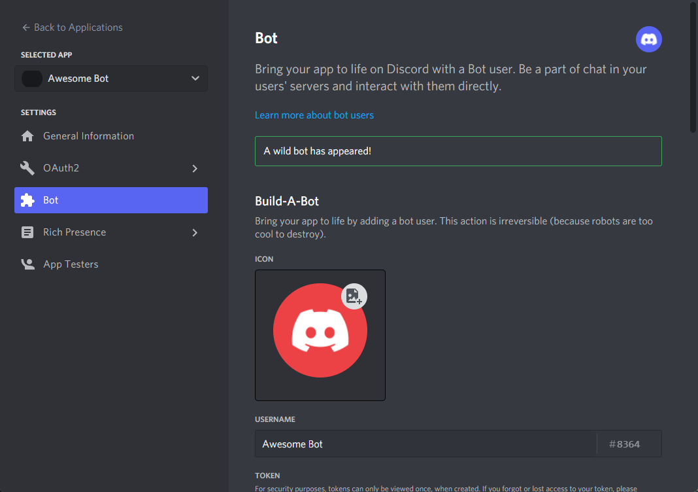

<h1 align="center">Text-to-Speech bot for Discord</h1>
<h3 align="center">Speak to your friends in a new way!</h2>
<p><p></p></p>
<p align="center">
<a href="https://python.org/downloads/">
</a> <a href="https://github.com/CoccodrillooXDS/TTS-bot/releases/latest"></p>
<p align="center">
<a href="https://discord.com/api/oauth2/authorize?client_id=832158681671532564&permissions=8&scope=applications.commands%20bot"></p>
<p align="center">
<a href="https://heroku.com/deploy"></a></p>


# **Table of Contents**

<details><summary>Click to view the table of contents</summary>

- [**Table of Contents**](#table-of-contents)
- [**Overview**](#overview)
- [**Features**](#features)
- [**Installation**](#installation)
  - [**Create a Discord bot**](#create-a-discord-bot)
  - [**Choose how you want to host the bot**](#choose-how-you-want-to-host-the-bot)
    - [**Host on your own server**](#host-on-your-own-server)
      - [**Install dependencies**](#install-dependencies)
      - [**Clone the repository**](#clone-the-repository)
      - [**Install pip requirements**](#install-pip-requirements)
      - [**Export the TOKEN variable**](#export-the-token-variable)
      - [**Start the bot**](#start-the-bot)
    - [**Host on Heroku**](#host-on-heroku)
      - [**Create an IBM Cloud account**](#create-an-ibm-cloud-account)
      - [**Create a Cloud Object Storage Instance**](#create-a-cloud-object-storage-instance)
      - [**Create IBM Cloud credentials**](#create-ibm-cloud-credentials)
      - [**Deploying the bot to Heroku**](#deploying-the-bot-to-heroku)
  - [**Invite the bot to your Discord server**](#invite-the-bot-to-your-discord-server)
- [**Contributing**](#contributing)
- [**License**](#license)
- [**TODO**](#todo)

</details>
<p></p>

# **Overview**

TTS is a **Text-to-Speech** bot for Discord. It uses the **[gTTS](https://pypi.org/project/gTTS/)** library to generate audio files from text. The bot then plays the audio file in the voice channel so other people don't have to stop what they are doing to read what you wrote.

# **Features**

* Give your text a voice!
* Read your text aloud!
* Run on any platform!
* Easily self-hostable on any server (even on [Heroku](https://www.heroku.com))!
* Easy to use!
* It's free!

# **Installation**

**The officially supported platforms are:**
* Windows
* Most Linux distributions

(It may work on MacOS, but I haven't tested it)

## **Create a Discord bot**

<details><summary>Click to view the instructions</summary>

To create a Discord bot, you will need to create a Discord application. You can do this by going to the [Discord Developer Portal](https://discord.com/developers/applications) and creating a new application.


After creating the application, you will need to create a bot account. You can do this by clicking on the application you created, "**Bot**" section on the left panel and the big blue button "**Add Bot**".


It will ask you if you want to continue, click "**Yes, do it!**".


You will now see a lot of informations and options about your new shiny bot, you will have to turn all "**Privileged Gateway Intents**" on by scrolling down in the page.




Next up, in the same page, you will have to click on "**Reset Token**"" and confirm the reset. If you have 2FA enabled, you will have to enter your 2FA code.


It will show you a token. Copy it and save it somewhere safe. **You will need this later**.


</details>
<p></p>

## **Choose how you want to host the bot**

You can choose to host the bot on your own server or on [Heroku](https://www.heroku.com) for free.

### **Host on your own server**

To host the bot on your own server, you will need to have admin/root access to the server to install packages.

<details><summary>Click to view the instructions</summary>

#### **Install dependencies**

You will need:

* Python 3.8 or later
* pip or pip3
* ffmpeg

You can install them by running the following commands in the terminal:

**Debian-based:**
```
# apt update
# apt install python3 python3-pip ffmpeg git
```
**Arch-based:**
```
# pacman -Syu python python-pip ffmpeg git
```
On **Windows** just install Python from the [Python website](https://www.python.org/downloads/).

#### **Clone the repository**

You can clone the repository with the green button at the top of the GitHub page or by running the following command in the terminal:
```
$ git clone https://github.com/CoccodrillooXDS/TTS-bot.git
$ cd TTS-bot
```

#### **Install pip requirements**
```
$ pip3 install -r requirements.txt
```

#### **Export the TOKEN variable**

The bot grabs the token from Envirorment Variables. You can do this by running the following command in the terminal:
```
$ export TOKEN=<your token>
```

#### **Start the bot**

You can start the bot with the following command:
```
$ python3 bot.py
```

</details>
<p></p>

### **Host on [Heroku](https://www.heroku.com)**


You will need to have an account on [Heroku](https://www.heroku.com) and on [IBM Cloud](https://cloud.ibm.com/registration) websites.
You will need an IBM Cloud account to store all server configurations because Heroku automatically deletes them. 

<details><summary>Click to view the instructions</summary>

#### **Create an IBM Cloud account**

Once you have an account on [IBM Cloud](https://cloud.ibm.com/registration), you will see a similar page:


#### **Create a Cloud Object Storage Instance**

Click on the "**Create resource**"" button on the top right of the page

You will now see a page with a catalog of available resources:


In the search bar, type "**Object Storage**" and click it. You will now see a similar page:


Leave everything as default, except for the "**Service name**" field if you want to change it, and click "**Create**".

It should now open this page:


If it doesn't open, click [this link](https://cloud.ibm.com/objectstorage) to open it.

#### **Create IBM Cloud credentials**

On the last page, click "**Service credentials**". You will now see a similar page:


Now click on "**New credential**" and if you want to change the name, do it. Keep the role as "**Writer**" and click "**Add**"

You will now see the new entry, click the copy button:


Now, open Notepad and paste what you just copied


Copy somewhere safe (with the Discord bot token) the "apikey" and "resource_instance_id" values. **You will need these later**.

Open the link of ["endpoints"](https://control.cloud-object-storage.cloud.ibm.com/v2/endpoints) with a browser like *Firefox*


Choose a public endpoint server and save it with the other values you saved before.

#### **Deploying the bot to Heroku**

Click on the "**Deploy to Heroku**" button at the top of the page or here:

[](https://heroku.com/deploy)

Login to your Heroku account. You will see a similar page:


Choose an app name and a region.

Then, clear all the Config Vars variables and put the ones you saved before.

Finally, click "**Deploy App**"

</details>
<p></p>

## **Invite the bot to your Discord server**

To add the bot to your server you will need to have the permission to **Manage Server**.
You will be able to add your bot using this link:

```https://discord.com/api/oauth2/authorize?client_id=<your-bot-client-id>&permissions=8&scope=applications.commands%20bot```

**NOTE**: you have to change the ```<your-bot-client-id>``` to your client id. You can get it from the [Discord Developer Portal](https://discord.com/developers/applications).

# **Contributing**
You can contribute to the project by making a pull request or by creating an issue.

You can also contribute by translating the bot to your language. Make sure to follow the same format as the English version or the bot might not work as intended.

To contribute, you can fork the repository and after you made your changes, you can create a pull request.

**Note** Some languages may have problems with the bot.

# **License**
This project is licensed under the [MIT license](LICENSE)


# **TODO**

- [ ] Implement Google Search Engine
- [ ] Implement Google Translate
- [ ] Implement new features!